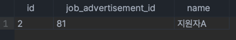

<h1>원티드 프리온보딩 백엔드 인턴쉽 과제</h1>

---
- 특징
  - api 응답은 ```Result<?>``` 객체를 사용해 응답 형식 규격화
    - message 필드 : 응답 결과 등을 전달해 줄 수 있다.
    - count 필드 : 목록, 검색 api 요청 시 갯수를 반환해 준다.
    - resultData 필드 : 응답 결과를 반환해준다. "result" 프로퍼티로 반환된다.
- ERD  
  
  

1. 채용공고 등록
   1. 요구사항 분석
   2. 구현과정
      - ```JobAdvertisementSaveRequestDto``` 로 요청받아 처리.
      - ```toEntity()``` 메소드를 통해 엔티티 저장
   3. api 테스트
      1. 요청 
      ```http request
       ### 등록
       POST http://localhost:8080/api/v1/job-advertisements/4
       Content-Type: application/json
         
       {         
         "position":"백엔드 주니어 개발자",
         "reward":500000,
         "content":"원티드랩에서 백엔드 주니어 개발자를 채용합니다. 자격요건은..",
         "skill":"Java",
         "nation": "한국",
         "region": "서울"
       }
      ```
      2. 응답
      ```http request
       {
         "message": "채용공고가 등록되었습니다.",
         "count": null,  // 채용 목록 갯수 프로퍼티
         "result": null  // 결과 반환 프로퍼티
       }
      ```

---


2. 채용공고 수정
   1. 요구사항 분석
      1. 회사는 채용공고를 수정할 수 있다.
   2. 구현과정
      1. ```JobAdvertisementUpdateRequestDto``` 로 요청받아 처리한다.
      2. 채용공고 엔티티 내부에 ```update``` 메소드로 값을 전달해 엔티티 값을 변경한다. (더티체킹)
   3. api 테스트
      1. 요청
      ```http request
       ### 수정
       PUT http://localhost:8080/api/v1/job-advertisements/3/75
       Content-Type: application/json
      
       {
         "position":"백엔드 주니어 개발자",
         "reward":1000000,
         "content":"채용내용",
         "skill":"Python",
         "nation": "미국",
         "region": "뉴욕"
       }
      ```
      2. 응답
      ```http request
       {
         "message": "채용공고가 수정되었습니다.",
         "count": null,
         "result": null
       }
      ```

---

3. 채용공고 삭제
   1. 요구사항 분석
   2. 구현과정
      1. ```JobAdvertisementDeleteDto``` 로 요청받아 처리한다.
      2. 요청 값은 채용공고 id 를 받는다. (파라미터 추가되면 ```JobAdvertisementDeleteDto``` 에 추가한다.)
   3. api 테스트
      1. 요청
      ```http request
       ### 삭제
       DELETE http://localhost:8080/api/v1/job-advertisements
       Content-Type: application/json
      
       {
         "job_advertisement_id": 45
       }
      ```
      2. 응답
      ```http request
       {
        "message": "채용공고가 삭제되었습니다.",
        "count": null,
        "result": null
       }
      ```

---

4. 채용공고 목록
   1. 요구사항 분석
      1. 사용자는 전체 채용 공고 목록을 볼 수 있다.
   2. 구현과정
      1. ```JobAdvertisementDefaultResponseDto``` 를 상속받은 ```JobAdvertisementResponseDto``` 로 요청받아 처리한다.
      2. ```JobAdvertisementResponseDto``` 내부에 빌더를 구현하고 서비스 레이어에서 아래와 같이 메소드 참조로 사용함.  
       
   3. api 테스트
      1. 요청
      ```http request
       ### 목록보기
       GET http://localhost:8080/api/v1/job-advertisements
      ```
      2. 응답
      ```http request
       {
         "message": "채용공고 목록을 불러왔습니다.",
         "count": 7,   // 채용공고 총 갯수
         "result": {
           "data": [    // data 프로퍼티 안에 반환
             {
               "job_advertisement_id": 81,
               "company_name": "카카오",
               "nation": "한국",
               "region": "서울",
               "position": "주니어 백엔드 개발자",
               "reward": 500000,
               "skill": "Spring"
             },
             {
               "job_advertisement_id": 80,
               "company_name": "카카오",
               "nation": "한국",
               "region": "서울",
               "position": "주니어 백엔드 개발자",
               "reward": 500000,
               "skill": "Java"
             },
             {
               "job_advertisement_id": 79,
                "company_name": "네이버",
                "nation": "한국",
                "region": "서울",
                "position": "주니어 백엔드 개발자",
                "reward": 500000,
                "skill": "Java"
             },
        
                 ....
      
           ]
         }
       }
      ```

---

5. 채용공고 검색
   1. 요구사항 분석
      1. 검색 키워드를 받아와 처리한다.
   2. 구현과정
      1. 회사이름이나 사용기술에 대해 키워드 검색을 한다.  
      
   3. api 테스트
      1. 요청
      ```http request
       ### 검색
       GET http://localhost:8080/api/v1/job-advertisements/search?keyword=ja
      ```
      2. 응답
      ```http request
       {
         "message": "검색 결과 입니다.",
         "count": 3,
         "result": {
           "data": [
             {
               "job_advertisement_id": 80,
               "company_name": "카카오",
               "nation": "한국",
               "region": "서울",
               "position": "주니어 백엔드 개발자",
               "reward": 500000,
               "skill": "Java"
             },
             {
               "job_advertisement_id": 78,
               "company_name": "네이버",
               "nation": "한국",
               "region": "서울",
               "position": "주니어 백엔드 개발자",
               "reward": 500000,
               "skill": "Java"
             },
             {
               "job_advertisement_id": 79,
               "company_name": "네이버",
               "nation": "한국",
               "region": "서울",
               "position": "주니어 백엔드 개발자",
               "reward": 500000,
               "skill": "Java"
             }
           ]
         }
       }
      ```

---

6. 채용공고 상세
   1. 요구사항 분석
      1. 채용내용 필드 추가 응답.
      2. 해당 회사가 올린 다른 공고 추가 응답.
   2. 구현과정
      1. ```JobAdvertisementDefaultResponseDto``` 를 상속 받아 ```JobAdvertisementDetailResponseDto``` 에 필요한 필드 추가.
       
   3. api 테스트
      1. 요청
      ```http request
      ### 상세보기
      GET http://localhost:8080/api/v1/job-advertisements/detail/81
      ```
      2. 응답
      ```http request
       {
         "message": "채용 상세 입니다.",
         "count": null,
         "result": {
           "data": {
              "job_advertisement_id": 81,
              "company_name": "카카오",
              "nation": "한국",
              "region": "서울",
              "position": "주니어 백엔드 개발자",
              "reward": 500000,
              "skill": "Spring",
              "content": "원티드랩에서 백엔드 주니어 개발자를 채용합니다. 자격요건은..",     // 채용 내용 추가 표시
              "otherJobAdvertisementIdList": [    // 다른 공고 id 리스트
                 75,
                 80
              ]
           }
         }
       }
      ```

---

5. 채용공고 지원
   1. 요구사항 분석
      1. 사용자는 해당 공고에 지원할 수 있다.
   2. 구현과정
      1. 지원 후 db에 지원한 공고 id 추가됨.  
      
   3. api 테스트
      1. 요청
      ```http request
       ### 지원
       POST http://localhost:8080/api/v1/user/apply
       Content-Type: application/json
      
       {
         "userId" : 2,
         "job_advertisement_id" : 81
       }
      ```
      2. 응답
      ```http request
       {
         "message": "지원 완료",
         "count": null,
         "result": null
       }
      ```


   


